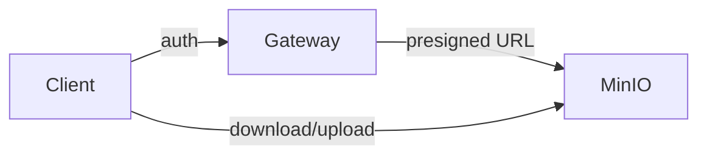

# Docs — Selfhost Cloud
Gateway + MinIO access with presigned URLs.
## Flow

```mermaid
flowchart LR
  Client[Client] -->|auth| Gateway[Gateway]
  Gateway[Gateway] -->|presigned URL| MinIO[MinIO]
  Client[Client] -->|download/upload| MinIO[MinIO]
```
